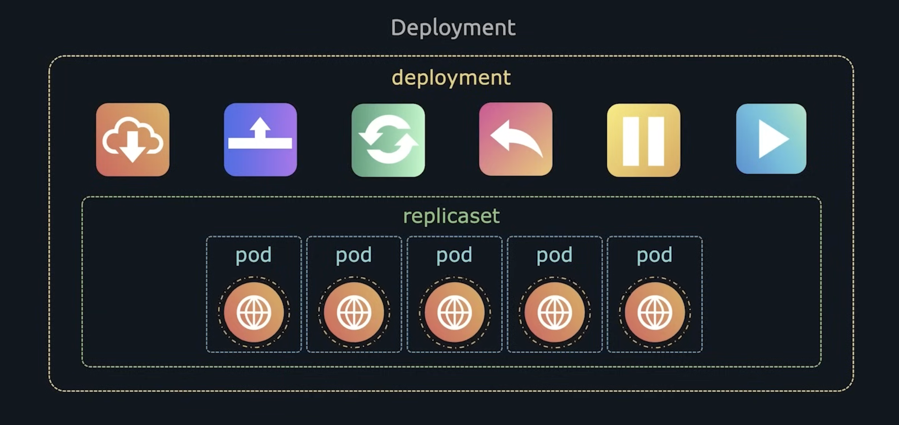

# Kubernetes Commands

## kubectl

```bash
 kubectl get nodes
```
- This is to see how many nodes are running in the cluster

```bash
kubectl run nginx --image=nginx
```
- This pull down a container image from public(Docker Hub) or private repository and creates a pod

```bash
kubectl get pods
```
- This will get information about the pods running on the cluster.


# Declarative Approach

##### This means creating a script to create and deploy application which allows for version control.

Kubernetes uses .yaml files:

- For Example

***pod-definition.yml***
```yaml
apiVersion: v1
kind: Pod
metadata:
    name: myapp-pod
    labels:
        app: myapp
        type: front-end

spec:
    containers:
        - name: nginx-container
          image: nginx

```
```bash
kubectl create -f pod-definition.yml
```
- This creates the pod based on the yaml file specified

```bash
kubectl describe pod myapp-pod
```
- This gets the information of the pods running on the cluster. (Replace myapp-pod with your pod name)

```bash
kubectl apply -f pod-definition.yml
```

- Kubectl Apply also can be used to create objects.


## Replica Sets

A ReplicaSet's purpose is to maintain a stable set of replica pods running at any given time usually, you define a deployment and let that deployment manage replicasets automatically.

A Replicaset fulfills its purpose by creatiing and deleting pods as needed to reach the desired number. When a RelicaSet needs to create new podsm it uses its pod template.


***replicaset-definition.yml***
```yaml
apiVersion: apps/v1
kind: ReplicaSet
metadata:
    name: myapp-replicaset
    labels:
        app: myapp
        type: front-end

spec:
  template:
    metadata:
      name: myapp-pod
      labels:
        app: myapp
        type: front-end

    spec:
      containers:
        - name: nginx-container
          image: nginx

  replicas: 3
  selector:
    matchLabels:
        type: front-end

```
- The match labels should same as in the metadata field

```bash
kubectl create -f replicaset-definition.yml
```
- Creates the replicaSet

```bash
kubectl get replicaset
```

- Information about the replicasets created.

##### Updating ReplicaSets
***replicaset-definition.yml***
```yaml
apiVersion: apps/v1
kind: ReplicaSet
metadata:
    name: myapp-replicaset
    labels:
        app: myapp
        type: front-end

spec:
  template:
    metadata:
      name: myapp-pod
      labels:
        app: myapp
        type: front-end

    spec:
      containers:
        - name: nginx-container
          image: nginx

  replicas: 6           ## change the number to update the replicaset
  selector:
    matchLabels:
        type: front-end

```

```bash
kubectl replace -f replicaset-definition.yml
```
- This is to update the number of replicasets. There are other ways to update the replicasets too but updating the yaml file is recommended.

The other ways:

```bash
kubectl scale --replicas=6 -f replicaset-definition.yml
```
```bash
kubectl scale --replicas=6 replicaset myapp-replicaset
```

There are ways to scale based on the load also.

```bash
kubectl delete replicaset myapp-replicaset
```

- "myapp-replicaset" represents the name of the replicaset.

## Deployment




***deployment-definition.yml***
```yaml
apiVersion: apps/v1
kind: Deployment    ### Only this changes
metadata:
    name: myapp-replicaset
    labels:
        app: myapp
        type: front-end

spec:
  template:
    metadata:
      name: myapp-pod
      labels:
        app: myapp
        type: front-end

    spec:
      containers:
        - name: nginx-container
          image: nginx

  replicas: 6           ## change the number to update the replicaset
  selector:
    matchLabels:
        type: front-end

```

```bash
kubectl create -f deployment-definition.yml
```

```bash
kubectl get deployments
```

- Lists deployments

```bash
kubectl get all
```
- Lists all the objects created which includes: pods, replicasets, and deployments.

#### Updating deployments

- Declarative approach is to edit the yaml file with the new version of the application


***replicaset-definition.yml***
```yaml
apiVersion: apps/v1
kind: ReplicaSet
metadata:
    name: myapp-replicaset
    labels:
        app: myapp
        type: front-end

spec:
  template:
    metadata:
      name: myapp-pod
      labels:
        app: myapp
        type: front-end

    spec:
      containers:
        - name: nginx-container
          image: nginx 1.7.2  ### Edit image version to update the application

  replicas: 6           ## change the number to update the replicaset
  selector:
    matchLabels:
        type: front-end

```
```bash
kubectl apply -f deployment-definition.yml
```
- Apply Configs


- ***Imperative*** approach: directly by commands

```bash
kubectl set image deployment/myapp-deployment \
                nginx-container=nginx:1.9.1
```